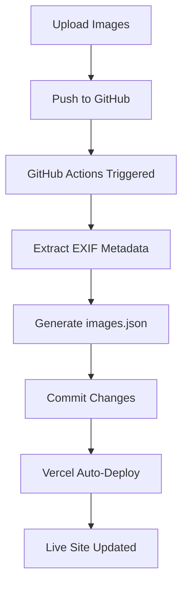

# GitHub Actions Workflows

## 🤖 Automated Image Pipeline

This repository uses GitHub Actions to automatically extract EXIF metadata from images and keep `public/data/images.json` up to date.

## Workflows

### 1. Image Pipeline (Recommended)

**File:** `image-pipeline.yml`

**Triggers:**
- 🔄 Automatically when you push images to `public/images/`
- 🖱️ Manually via GitHub Actions UI

**What it does:**
1. ✅ Counts images in color/bw folders
2. ✅ Extracts EXIF metadata (ISO, aperture, shutter, camera, lens)
3. ✅ Generates `public/data/images.json`
4. ✅ Commits changes back to repository
5. ✅ Triggers Vercel deployment automatically

**Usage:**

```bash
# Add images to the repository
cp my-photo.jpg public/images/color/
git add public/images/color/my-photo.jpg
git commit -m "Add new wildlife photo"
git push

# GitHub Actions will automatically:
# - Extract EXIF metadata
# - Update images.json
# - Commit changes
# - Deploy to Vercel
```

### 2. Image Metadata Sync (Lightweight)

**File:** `image-metadata-sync.yml`

**Triggers:**
- Only when image files change

**What it does:**
- Same as Image Pipeline but simplified

## Manual Trigger

You can manually trigger the workflow from GitHub:

1. Go to **Actions** tab
2. Select **Image Pipeline (Full)**
3. Click **Run workflow**
4. Choose options:
   - `force_regenerate`: Regenerate all metadata even if unchanged

## What Gets Extracted Automatically

### ✅ From EXIF Data:
- **Camera body**: Canon EOS R5, Nikon Z9, Sony A1
- **ISO**: 400, 800, 1600, etc.
- **Aperture**: f/5.6, f/4.0, etc.
- **Shutter speed**: 1/1000s, 1/500s, etc.
- **Lens**: RF 100-500mm, 600mm, etc.
- **Focal length**: 400mm, 600mm, etc.
- **Date taken**: From EXIF DateTimeOriginal
- **GPS coordinates**: If available in EXIF
- **Image dimensions**: Width x Height

### ❌ Manual Additions Required:

After the workflow runs, you need to manually edit `public/data/images.json` to add:

- **Location name**: "Serengeti National Park, Tanzania"
- **Story**: Behind-the-lens narrative for lightbox
- **Time of day**: "dawn" | "midday" | "dusk" | "night" (for homepage)

## Workflow Process



## Example Output

When you push images, the workflow will create a commit like:

```
🤖 Auto-update image metadata

- Extracted EXIF data from 25 images
- Color images: 18
- B&W images: 7

Generated by image-pipeline workflow

🤖 Generated with Claude Code
Co-Authored-By: Claude <noreply@anthropic.com>
```

## Workflow Summary

After running, you'll see a summary in the Actions tab:

```markdown
## ✅ Image Pipeline Complete!

### 📊 Statistics
- Total Images: 25
- Color Gallery: 18 images
- B&W Gallery: 7 images

### 🎯 Actions Taken
- ✅ Extracted EXIF metadata
- ✅ Generated public/data/images.json
- ✅ Committed changes

### 📝 Manual Actions Needed
- 📍 Add location names
- 📖 Add behind-the-lens stories
- 🌅 Add time of day tags
```

## Troubleshooting

### Workflow doesn't trigger

**Check:**
- Images are in `public/images/color/` or `public/images/bw/`
- Files have image extensions (.jpg, .jpeg, .png, .webp)
- You pushed to `main` branch

### No EXIF data extracted

**Possible causes:**
- Images don't have EXIF metadata (edited/exported without preserving)
- Images are screenshots or generated (no camera data)

**Solution:**
- Manually add camera settings in `images.json`
- Use RAW files converted to JPG with EXIF preserved

### Workflow fails

**Check workflow logs:**
1. Go to Actions tab
2. Click on failed workflow
3. View logs for error details

**Common fixes:**
- Corrupt image files → Remove and re-add
- Large files → Optimize before uploading
- Missing dependencies → Clear cache and rerun

## Local Testing

Test the metadata extraction locally before pushing:

```bash
# Add images locally
cp my-photo.jpg public/images/color/

# Run metadata generator
npm run generate-metadata

# Review generated metadata
cat public/data/images.json

# If looks good, commit
git add public/images/color/ public/data/images.json
git commit -m "Add new photos with metadata"
git push
```

## Future Enhancements

Epic 7 from planning artifacts includes:
- 🔄 Google Drive sync (Story 7.2)
- 🎨 Image optimization during sync (Story 7.3)
- 📍 CSV metadata override (Story 7.5)
- ☁️ Vercel Blob Storage integration (Story 7.6)

## Related Documentation

- **Script details**: See `scripts/IMAGE-METADATA-README.md`
- **Epic 7**: See `_bmad-output/planning-artifacts/epics.md` (Stories 7.1-7.6)
- **Architecture**: See Architecture Decision #7 (Image Pipeline)
