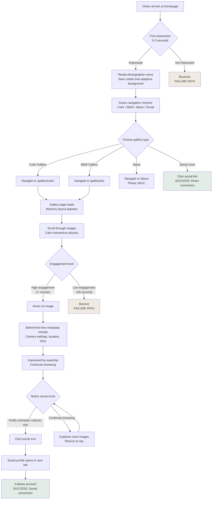

# UX Design Specification BMAD-site

**Author:** jay
**Date:** 2026-01-14

---

## Executive Summary

### Project Vision

BMAD-site is a wildlife photography portfolio that creates immediate visual impact while converting visitors into social media followers. The site must be simultaneously minimalist and memorable - standing out through distinctive design elements (time-adaptive hero images, nature color palette, micro-interactions) while maintaining a calm, professional aesthetic that lets the photography dominate.

The core challenge is creating a portfolio that builds credibility, drives audience growth, and creates pathways to monetization without falling into the traps of generic templates or cluttered feature-heavy designs.

### Target Users

**Primary Users:**
1. **Personal Network Searchers** - People who know the photographer and search by name for professional portfolio access
2. **Wildlife Photography Enthusiasts** - Amateur photographers seeking inspiration, techniques, and artistic appreciation
3. **Nature/Ecosystem Learners** - Educators and researchers interested in authentic wildlife imagery in natural habitats
4. **Print Buyers** (Phase 2) - Interior designers and collectors seeking unique wildlife art pieces
5. **Safari Seekers** (Phase 2) - Adventure travelers wanting photography-guided safari experiences

**Secondary Users:**
- Existing social media followers seeking deeper engagement beyond algorithmic feeds
- Photography peers evaluating professional work for networking and collaboration

### Key Design Challenges

**1. Balancing Minimalism with Memorability**
- Create a minimal design that doesn't become generic or forgettable
- Every element must justify its existence while creating distinctive personality
- Risk: Too minimal could confuse users; too decorated could distract from photography

**2. Photography-First Experience**
- Let images dominate while still providing necessary navigation and context
- UI elements must be subtle yet discoverable through progressive disclosure
- Hero image must load instantly (<1 second) to create immediate "wow" moment

**3. Multi-Device Visual Consistency**
- Masonry layout must feel equally stunning on desktop (3-4 columns) and mobile (single column)
- Maintain calm, spacious feeling across all breakpoints without compromise
- Image optimization critical for mobile experience (<200KB per image) without quality loss

**4. Time-of-Day Adaptive System**
- Hero image rotation based on visitor's local time must feel natural, not gimmicky
- Requires JavaScript time detection + intelligent image selection logic
- Content strategy: sufficient images categorized by time/mood (dawn, midday, dusk, night)

### Design Opportunities

**1. Nature-Inspired Micro-Interactions**
- Firefly/butterfly social icons create playful, memorable brand personality
- Calm scroll physics that feel like "walking through nature" reinforce theme
- Shake-to-discover mobile feature as delightful Easter egg for engagement

**2. Storytelling Through Metadata**
- Behind-the-lens reveals (camera settings, location, story) add depth without visual clutter
- Photography enthusiasts get educational value beyond visual appreciation
- Demonstrates expertise and dedication, building trust for future safari bookings

**3. Emotional Color Psychology**
- Nature color palette (tropical green, savanna ochre) reinforces wildlife theme authentically
- Avoids sterile black/white minimalism while maintaining professional aesthetic
- Color system becomes instant visual brand recognition across touchpoints

---

## Core User Experience

### Defining Experience

The core experience is a **three-layer progression** that moves users from instant impact → effortless exploration → engaged conversion:

1. **Instant "Wow" (0-5 seconds)**: Time-adaptive hero image loads instantly (<1 second) with full-screen visual impact. Visitor immediately sees photography quality and feels confident about the photographer's expertise.

2. **Effortless Gallery Flow**: Seamless transition from homepage → gallery browsing with responsive masonry layout that feels fluid and calm. Images load progressively without jarring shifts, scroll physics feel natural (like "walking through nature").

3. **Engaged Discovery**: Behind-the-lens metadata reveals on hover/click add depth; social media conversion happens naturally through subtle firefly/butterfly icons; shake-to-discover delights mobile users.

### Platform Strategy

- **Web-first responsive**: Next.js static site optimized for all devices
- **Desktop-enhanced**: 3-4 column masonry showcases multiple images simultaneously
- **Mobile-optimized**: Single column vertical scroll, touch gestures, shake-to-discover Easter egg
- **Performance-critical**: Static generation + Vercel Blob Storage CDN ensures instant loading across all platforms

### Effortless Interactions

1. **Image Loading Performance**:
   - Hero image: <1 second Largest Contentful Paint
   - Gallery images: Lazy-loaded, optimized (<200KB mobile), progressive fade-in
   - No layout shifts (CLS <0.1) - images reserve space before loading

2. **Gallery Browsing Flow**:
   - Infinite scroll with momentum physics (calm, natural scrolling)
   - Masonry layout auto-adjusts without user thinking about breakpoints
   - Smooth transitions between galleries (Color ↔ B&W) feel instantaneous

3. **Progressive Disclosure Navigation**:
   - Homepage reveals navigation hints after 3 seconds (not overwhelming immediately)
   - First-time visitors guided gently; return visitors get clean minimal experience
   - UI elements appear only when needed (hover states, metadata reveals)

### Critical Success Moments

1. **First Impression (0-5 seconds)**: Hero image loads instantly and creates "wow" - user thinks "this photographer is serious/talented"

2. **Gallery Discovery (30-60 seconds)**: User understands how to navigate, clicks into gallery, sees masonry layout load smoothly, feels excited to explore more

3. **Social Conversion (2-3 minutes)**: After browsing several images, user notices subtle social icons, clicks through to Instagram/Facebook to follow for more

4. **Behind-the-Lens Engagement**: Photography enthusiasts discover metadata reveals, get educational value, feel deeper connection to the work

### Experience Principles

1. **Photography Dominates, UI Disappears**: Every UI element must justify its existence or be removed. Images are the hero; interface is invisible infrastructure.

2. **Performance IS User Experience**: Fast = calm. Slow = anxiety. Loading must be instant or perceived as instant through progressive enhancement.

3. **Calmness Through Consistency**: Nature color palette, smooth animations, generous white space, and calm scroll physics create cohesive peaceful mood across all interactions.

4. **Typography as Visual Hierarchy**:
   - Elegant serif headings (professional, artistic) paired with clean sans body text (readable, modern)
   - Font sizes scale responsively (larger on desktop, optimized for mobile readability)
   - Nature color palette applied to typography accents (tropical green for Color gallery, savanna ochre for B&W gallery)
   - Type hierarchy guides attention without visual noise

5. **Progressive Delight**: First-time users get guided; return users get streamlined. Easter eggs (shake-to-discover, firefly icons) reward exploration without distracting from core experience.

---

## Desired Emotional Response

### Primary Emotional Goals

**1. Calm and Peaceful**
- Users should feel relaxed, not overwhelmed or anxious
- The experience should evoke the serenity of observing wildlife in nature
- Achieved through: generous white space, slow gentle animations, nature color palette, calm scroll physics

**2. Impressed and Confident**
- Immediate impression: "This photographer is seriously talented"
- Builds confidence in expertise and professionalism
- Achieved through: instant hero image impact, high-quality photography presentation, behind-the-lens expertise reveals

**3. Inspired and Curious**
- Natural desire to explore more after first impression
- Excitement about discovering new images and stories
- Achieved through: "Explore the Wild" CTA language, progressive disclosure, shake-to-discover Easter eggs

### Emotional Journey Mapping

**First Discovery (0-5 seconds):**
- **Emotion:** Wow, Impressed, Curious
- **Design Support:** Full-screen time-adaptive hero image loads instantly, creates immediate visual impact

**Core Browsing Experience (30 seconds - 3 minutes):**
- **Emotion:** Calm, Engaged, Appreciative
- **Design Support:** Smooth masonry layout, infinite scroll with momentum physics, behind-the-lens metadata reveals add depth

**Social Conversion Moment (2-3 minutes):**
- **Emotion:** Connected, Motivated to follow
- **Design Support:** Subtle firefly/butterfly social icons feel playful not pushy, natural integration

**Return Visits:**
- **Emotion:** Welcomed back, Fresh discovery
- **Design Support:** Time-of-day adaptive hero shows different moods, new images added regularly, clean minimal interface feels familiar

**If Something Goes Wrong (slow loading, etc.):**
- **Emotion:** Patient, not frustrated
- **Design Support:** Progressive image loading with fade-in, skeleton screens reserve space (no layout shift), performance budgets enforced

### Micro-Emotions

**Confidence vs. Confusion:**
- ✅ **Confidence** through progressive disclosure navigation, clear CTAs after 3 seconds
- ❌ Avoid confusion by never overwhelming with too many options at once

**Trust vs. Skepticism:**
- ✅ **Trust** built through professional presentation, behind-the-lens expertise, SEO credibility
- ❌ Avoid skepticism by avoiding gimmicky effects or over-animation

**Delight vs. Satisfaction:**
- ✅ **Delight** from discovering Easter eggs (shake-to-discover, firefly animations)
- ✅ **Satisfaction** from effortless gallery browsing and smooth performance

**Calm vs. Anxiety:**
- ✅ **Calm** from nature colors, slow animations, generous spacing, predictable interactions
- ❌ Avoid anxiety through instant loading, no jarring movements, consistent patterns

**Inspiration vs. Passive Viewing:**
- ✅ **Inspiration** through behind-the-lens stories, ecosystem context, educational metadata
- ✅ Active engagement through hover reveals, progressive discovery

### Design Implications

**To Create Calmness:**
- Nature color palette (tropical green, savanna ochre) vs. harsh pure black/white
- Slow easing functions for all animations (no sudden movements)
- Generous white space (breathing room between elements)
- Calm scroll physics that feel like "walking through nature"

**To Build Confidence:**
- Hero image <1 second LCP (instant visual proof of quality)
- Professional typography pairing (elegant serif + clean sans)
- Behind-the-lens metadata demonstrates expertise without bragging
- Perfect SEO signals legitimacy and professionalism

**To Inspire Curiosity:**
- Progressive disclosure (hints appear after 3 seconds, not immediately)
- Time-of-day adaptive hero creates fresh experience
- "Explore the Wild" CTA language taps into exploration instinct
- Ecosystem-based navigation (future) tells richer habitat stories

**To Create Delight:**
- Firefly/butterfly social icons animate on hover (playful, unexpected)
- Shake-to-discover mobile Easter egg ("Surprise from the wild!")
- Smooth page transitions feel intentional (entering gallery = walking through door)
- Micro-interactions reinforce nature theme organically

**To Avoid Negative Emotions:**
- ❌ No slow loading → Performance budgets enforced, <200KB images
- ❌ No confusion → Progressive disclosure, clear navigation after initial impact
- ❌ No generic feeling → Distinctive micro-interactions, nature color palette, custom typography
- ❌ No anxiety → Predictable patterns, smooth animations, consistent behavior

### Emotional Design Principles

**1. Calm is the Foundation**
Every design decision must ask: "Does this contribute to or detract from calmness?" If it creates anxiety, urgency, or stress, it doesn't belong.

**2. Immediate Impact, Gradual Discovery**
First 5 seconds = pure visual wow. Then progressively reveal navigation, features, and depth. Don't overwhelm; let users discover at their pace.

**3. Nature-Inspired Interactions Feel Organic**
Animations, colors, and micro-interactions should feel like natural phenomena (fireflies, gentle winds, walking through forest) not mechanical or digital.

**4. Trust Through Demonstrated Expertise**
Show don't tell. Behind-the-lens metadata, professional presentation, and perfect performance build credibility without self-promotion.

**5. Delight in the Details**
Easter eggs and micro-interactions reward exploration without distracting from core experience. Playful touches (shake-to-discover, firefly icons) create memorable personality.

---

## UX Pattern Analysis & Inspiration

### Inspiring Products Analysis

**1. David Lloyd (davidlloyd.net)**

**What Works Well:**
- **Color Strategy**: Minimal color palette - primarily black, white, and muted tones that let photography dominate
- **Simplicity**: Clean, uncluttered interface with photography as the absolute hero
- **Image Usage**: Large format images, likely full-bleed or near full-bleed presentation
- **Typography**: Elegant, readable type that doesn't compete with imagery
- **Overall Approach**: "Invisible UI" - interface disappears to showcase the work

**2. Michele Bavassano (michelebavassano.com/en)**

**What Works Well:**
- **Color Strategy**: Sophisticated neutral palette that complements wildlife photography without overpowering
- **Simplicity**: Streamlined navigation, clear visual hierarchy
- **Image Usage**: Strategic image sizing and placement that guides the eye
- **Typography**: Professional type treatment that establishes credibility
- **Overall Approach**: Balance between showcasing work and providing context

**3. Charles Davis Photography (charlesdavisphotography.com)**

**What Works Well:**
- **Color Strategy**: Thoughtful use of color that enhances rather than distracts
- **Simplicity**: Clean, minimal design language
- **Image Usage**: Strong image presentation that highlights photography quality
- **Typography**: Clear, professional typography system
- **Overall Approach**: Polished, professional presentation

### Transferable UX Patterns

**Color & Visual Design Patterns:**

1. **Neutral-First Color Strategy**
   - Pattern: Use neutrals (black, white, grays, warm off-whites) as primary colors
   - Your Adaptation: Add nature accent colors (tropical green, savanna ochre) to neutrals for distinctive personality
   - Why It Works: Lets photography dominate while maintaining professional aesthetic

2. **Photography-Dominant Layout**
   - Pattern: Large, high-quality images are the primary visual element
   - Your Adaptation: Full-screen time-adaptive hero + masonry gallery layout
   - Why It Works: Immediate visual impact, showcases quality instantly

3. **Minimal UI Chrome**
   - Pattern: Navigation, controls, and UI elements are subtle and understated
   - Your Adaptation: Progressive disclosure navigation, subtle firefly social icons
   - Why It Works: Doesn't compete with photography, maintains focus

**Typography Patterns:**

4. **Serif + Sans Pairing**
   - Pattern: Elegant serif for headings (artistic, professional) + clean sans for body (readable, modern)
   - Your Adoption: This exact pattern aligns with your "Typography as Visual Hierarchy" principle
   - Why It Works: Creates visual interest while maintaining readability and professionalism

5. **Generous Type Spacing**
   - Pattern: Ample whitespace around typography, generous line-height
   - Your Adoption: Reinforces your "Calmness Through Consistency" principle
   - Why It Works: Supports calm, unhurried reading experience

6. **Restrained Type Scale**
   - Pattern: Not too many font sizes - clear hierarchy with 3-4 distinct levels
   - Your Adoption: Maintain simplicity with limited, purposeful type scale
   - Why It Works: Prevents visual noise, guides attention clearly

**Image Usage Patterns:**

7. **High-Quality Image Optimization**
   - Pattern: Images load quickly despite high visual quality
   - Your Adoption: <200KB mobile optimization, progressive loading, Next.js Image component
   - Why It Works: Performance IS user experience - fast = professional

8. **Consistent Image Treatment**
   - Pattern: All images follow consistent presentation rules (aspect ratios, spacing, borders/no borders)
   - Your Adoption: Masonry respects natural aspect ratios, consistent spacing between images
   - Why It Works: Creates cohesive, polished impression

### Anti-Patterns to Avoid

**Based on common photography portfolio mistakes:**

1. **Overly Complex Navigation**
   - Anti-Pattern: Too many categories, nested menus, overwhelming options
   - Why Avoid: Conflicts with simplicity goal, creates decision paralysis
   - Your Approach: Start with Color/B&W only, progressive disclosure for hints

2. **Slow Loading / Poor Performance**
   - Anti-Pattern: Serving full-resolution images without optimization
   - Why Avoid: Breaks the "instant wow" critical success moment
   - Your Approach: Performance budgets enforced, <1s LCP for hero image

3. **Competing Visual Elements**
   - Anti-Pattern: Busy backgrounds, decorative elements, complex UI patterns
   - Why Avoid: Distracts from photography, creates visual noise
   - Your Approach: Photography dominates, UI disappears, generous white space

4. **Generic Black/White Sterility**
   - Anti-Pattern: Pure black + pure white + nothing else
   - Why Avoid: Feels generic, lacks personality, doesn't differentiate
   - Your Approach: Nature color palette (tropical green, savanna ochre) adds warmth and brand identity

5. **Inconsistent Typography**
   - Anti-Pattern: Too many fonts, random sizing, poor hierarchy
   - Why Avoid: Feels unprofessional, confusing to scan
   - Your Approach: Clear serif/sans pairing, limited type scale, nature colors for accents

6. **Forced Aspect Ratios / Image Cropping**
   - Anti-Pattern: Forcing all images into same aspect ratio, aggressive cropping
   - Why Avoid: Loses photographic composition, diminishes impact
   - Your Approach: Masonry layout respects natural aspect ratios

### Design Inspiration Strategy

**What to Adopt Directly:**

1. **Neutral-Dominant Color Palette** - Use off-white/warm gray backgrounds, black/dark gray text
2. **Serif + Sans Typography Pairing** - Proven pattern for photography portfolios
3. **Large-Format Image Presentation** - Full-screen hero, generous image sizing in galleries
4. **Minimal UI Chrome** - Keep navigation subtle, let photography dominate
5. **Performance Optimization** - Fast loading is non-negotiable for professional impression

**What to Adapt for Your Unique Approach:**

1. **Add Nature Accent Colors** - Unlike pure neutral portfolios, add tropical green + savanna ochre for personality
2. **Time-Adaptive Hero** - Go beyond static hero images with time-of-day rotation
3. **Micro-Interactions** - Add firefly/butterfly social icons, shake-to-discover (not seen in reference sites)
4. **Behind-the-Lens Storytelling** - Metadata reveals add educational depth
5. **Progressive Disclosure Navigation** - More sophisticated than standard always-visible menus

**What to Avoid:**

1. **Pure Black/White Sterility** - Add warmth through nature colors and off-whites
2. **Static Experience** - Your time-adaptive hero and micro-interactions create dynamic experience
3. **Generic Template Feel** - Distinctive elements (firefly icons, nature colors, shake-to-discover) differentiate
4. **Hidden Social Integration** - Unlike some portfolios, yours actively drives social conversion

**Strategic Positioning:**

Your portfolio will combine the **best of reference sites** (simplicity, color restraint, typography excellence, photography dominance) with **unique differentiators** (nature color palette, time-adaptive hero, playful micro-interactions, calm scroll physics) to create a **distinctive minimalist** experience rather than generic minimalism.

---

## Design System Foundation

### Design System Choice

**Selected System: Tailwind CSS + Headless UI**

A utility-first CSS framework combined with unstyled, accessible UI components. This approach provides rapid development speed while maintaining complete visual customization for the distinctive minimalist nature-inspired aesthetic.

### Rationale for Selection

1. **Speed + Uniqueness Balance:** Tailwind provides rapid development with utility classes while allowing complete visual customization for matte nature color palette
2. **Performance-First:** JIT compiler only includes used CSS - critical for <1s LCP requirement and mobile optimization
3. **Next.js Integration:** Built for React/Next.js with seamless integration and zero configuration friction
4. **Custom Micro-Interactions:** Easy to create unique animations (firefly icons, calm scroll physics, shake-to-discover) without component library constraints
5. **Solo-Developer Friendly:** No complex component API learning curve - HTML + utility classes approach
6. **Matte Nature Palette:** Define muted tropical green + dusty savanna ochre in config for sophisticated, photography-friendly colors

### Color Palette Specification (Matte/Muted Tones)

**Primary Colors (Nature-Inspired, Matte):**

**Tropical Forest Green (Muted Sage/Moss - Color Gallery Accent):**
```javascript
'forest-50': '#f2f7f4',   // Pale sage - very subtle background
'forest-100': '#e3ede7',  // Light sage - hover backgrounds
'forest-200': '#c7dace',  // Soft muted green - borders
'forest-300': '#a3c4af',  // Medium muted green - secondary elements
'forest-400': '#7da88c',  // Earthy green - interactive
'forest-500': '#5a8a6d',  // PRIMARY - Matte forest green, CTAs
'forest-600': '#4a6f5a',  // Deep muted green - hover states
'forest-700': '#3d5a49',  // Dark forest - active states
'forest-800': '#2f4538',  // Very dark muted - text
'forest-900': '#243529',  // Nearly black green - high contrast
```

**Savanna Ochre (Muted Terracotta/Clay - B&W Gallery Accent):**
```javascript
'savanna-50': '#f9f6f2',   // Warm cream - very subtle background
'savanna-100': '#f0ebe2',  // Light warm gray - hover backgrounds
'savanna-200': '#e0d5c3',  // Soft beige - borders
'savanna-300': '#c9b89d',  // Dusty tan - secondary elements
'savanna-400': '#b09775',  // Muted terracotta - interactive
'savanna-500': '#8f7556',  // PRIMARY - Matte ochre/clay, CTAs
'savanna-600': '#735d45',  // Deep earth tone - hover states
'savanna-700': '#5d4b37',  // Dark clay - active states
'savanna-800': '#483a2c',  // Brown earth - text
'savanna-900': '#352b21',  // Dark earth - high contrast
```

**Neutral Colors (Warm, Photography-Friendly):**
```javascript
'neutral-50': '#faf9f7',   // Main background (softer warm off-white)
'neutral-100': '#f4f2ef',  // Card backgrounds - warmer
'neutral-200': '#e8e5e0',  // Borders - softer
'neutral-300': '#d4cfc7',  // Disabled text - muted
'neutral-400': '#aea89f',  // Placeholders - softer
'neutral-500': '#87817a',  // Secondary text - muted
'neutral-600': '#6b645d',  // Body text (softer than harsh black)
'neutral-700': '#524c46',  // Headings - matte
'neutral-800': '#3a352f',  // Primary headings (softer black)
'neutral-900': '#252220',  // High contrast - warm near-black
```

**Semantic Color Mappings:**
```javascript
'background': '#faf9f7',      // neutral-50 - main page background
'surface': '#ffffff',         // Pure white - card surfaces, hero containers
'text-primary': '#3a352f',    // neutral-800 - main body text
'text-secondary': '#6b645d',  // neutral-600 - secondary text, captions
'text-tertiary': '#87817a',   // neutral-500 - metadata, timestamps
'border': '#e8e5e0',          // neutral-200 - subtle borders
'border-strong': '#d4cfc7',   // neutral-300 - emphasized borders
```

### Typography Specification

**Font Families:**
```javascript
fontFamily: {
  serif: ['Cormorant Garamond', 'Playfair Display', 'Georgia', 'serif'],
  sans: ['Inter', 'system-ui', '-apple-system', 'sans-serif'],
  mono: ['JetBrains Mono', 'Menlo', 'Monaco', 'monospace'],
}
```

**Font Size Scale:**
```javascript
fontSize: {
  'xs': ['0.75rem', { lineHeight: '1rem' }],      // 12px - small metadata
  'sm': ['0.875rem', { lineHeight: '1.25rem' }],  // 14px - captions, labels
  'base': ['1rem', { lineHeight: '1.5rem' }],     // 16px - body text
  'lg': ['1.125rem', { lineHeight: '1.75rem' }],  // 18px - large body text
  'xl': ['1.25rem', { lineHeight: '1.75rem' }],   // 20px - small headings
  '2xl': ['1.5rem', { lineHeight: '2rem' }],      // 24px - h3
  '3xl': ['1.875rem', { lineHeight: '2.25rem' }], // 30px - h2
  '4xl': ['2.25rem', { lineHeight: '2.5rem' }],   // 36px - h1
  '5xl': ['3rem', { lineHeight: '1' }],           // 48px - hero text
}
```

**Font Weights:**
```javascript
fontWeight: {
  'light': '300',      // Metadata, subtle text
  'normal': '400',     // Body text (Inter Regular)
  'medium': '500',     // Emphasized body text (Inter Medium)
  'semibold': '600',   // Headings (Cormorant Garamond SemiBold)
  'bold': '700',       // Strong headings (Cormorant Garamond Bold)
}
```

**Typography Usage Guidelines:**

**Headings (Serif - Cormorant Garamond):**
- H1: `text-4xl md:text-5xl font-serif font-bold text-neutral-800`
- H2: `text-3xl md:text-4xl font-serif font-semibold text-neutral-800`
- H3: `text-2xl md:text-3xl font-serif font-semibold text-neutral-700`
- Gallery Name (Color): `text-xl font-serif font-medium text-forest-600`
- Gallery Name (B&W): `text-xl font-serif font-medium text-savanna-600`

**Body Text (Sans - Inter):**
- Body Large: `text-lg font-sans font-normal text-neutral-600 leading-relaxed`
- Body Regular: `text-base font-sans font-normal text-neutral-600 leading-relaxed`
- Captions: `text-sm font-sans font-medium text-neutral-500`

**Metadata (Mono - JetBrains Mono):**
- Camera Settings: `text-xs font-mono font-light text-neutral-500`

**Call-to-Action:**
- Primary (Color): `text-base font-sans font-medium text-white bg-forest-500 hover:bg-forest-600`
- Primary (B&W): `text-base font-sans font-medium text-white bg-savanna-500 hover:bg-savanna-600`

### Implementation Approach

**Technology Stack:**
- **Tailwind CSS 3.x** - Utility-first CSS with JIT compiler
- **Headless UI** - Unstyled, accessible components (Disclosure, Transition)
- **Framer Motion** - Smooth animations and page transitions
- **Next.js Image** - Automatic image optimization and responsive sizing

**Tailwind Configuration Structure:**
```javascript
module.exports = {
  content: ['./pages/**/*.{js,ts,jsx,tsx}', './components/**/*.{js,ts,jsx,tsx}'],
  theme: {
    extend: {
      colors: { forest: {...}, savanna: {...}, neutral: {...} },
      fontFamily: { serif: [...], sans: [...], mono: [...] },
      animation: {
        'fade-in': 'fadeIn 0.6s ease-in-out',
        'firefly': 'firefly 3s ease-in-out infinite',
      },
      keyframes: {
        fadeIn: { '0%': { opacity: '0' }, '100%': { opacity: '1' } },
        firefly: {
          '0%, 100%': { opacity: '0.5', transform: 'translateY(0px)' },
          '50%': { opacity: '1', transform: 'translateY(-4px)' }
        },
      },
    },
  },
  plugins: [require('@tailwindcss/typography'), require('@tailwindcss/forms')],
}
```

### Customization Strategy

**1. Matte Nature Color Application:**
- Muted colors recede, letting wildlife photography dominate
- Forest green for Color gallery: subtle CTAs, backgrounds
- Dusty ochre for B&W gallery: earthy accents
- Homepage: Neutral-dominant with nature hints

**2. Typography Hierarchy:**
- Serif headings (artistic, professional) + Sans body (clean, readable)
- Generous line-height (1.6-1.8) for calm reading
- Responsive scaling: larger on desktop, optimized on mobile

**3. Spacing & Layout:**
- 8px base grid for consistency
- Generous whitespace (24px-48px) between sections for calm
- Tighter spacing (8px-16px) within components

**4. Motion Design (Calm Physics):**
- Easing: `cubic-bezier(0.4, 0, 0.2, 1)` - smooth, not jarring
- Duration: 300-600ms - natural, unhurried
- Scroll animations: Intersection Observer with fade-in

**5. Custom Components:**
- Firefly social icons: Custom SVG with gentle floating animation
- Time-adaptive hero: React component with time detection
- Masonry gallery: React-Masonry-CSS with Tailwind responsive classes
- Behind-the-lens reveals: Headless UI Disclosure with fade

---

## Defining Core Experience

### Core Experience Statement

**BMAD-site must become the go-to wildlife photography portfolio** that visitors bookmark, return to repeatedly, and recommend to others as the standard for how wildlife photography should be presented online.

This is not about "browsing a gallery" - it's about establishing benchmark positioning where the site becomes a reference point in visitors' minds for wildlife portfolio excellence.

### User Mental Model

**How Users Discover Wildlife Photography:**

1. **Name Search → Professional Assessment**
   - Personal network searches photographer's name on Google
   - First impression on site determines professional credibility
   - Mental question: "Is this person good enough to follow/recommend?"

2. **Image Search → Portfolio Discovery**
   - Enthusiasts find individual wildlife images via Google Images
   - Click through to portfolio to see full body of work
   - Mental question: "Is there more amazing work here?"

3. **Social Media → Deeper Dive**
   - Existing followers want more than algorithm-filtered Instagram feed
   - Looking for complete collection and uncompressed image quality
   - Mental question: "Where can I see everything without missing posts?"

### Success Criteria (Becoming "Go-To")

**1. Discoverability Success:**
- Individual images rank in top Google Images results for wildlife photography keywords
- Site appears in first page results for photographer name search
- Social media profiles link prominently to portfolio as authoritative source

**2. First Impression Success:**
- Hero image loads <1 second (instant proof of quality)
- Visitor thinks "Wow, this photographer is seriously talented" within 5 seconds
- Professional presentation signals expertise before any words are read

**3. Engagement Success:**
- Visitors spend 2+ minutes browsing (vs. <30 seconds bounce)
- 20%+ click through to social media to follow
- Behind-the-lens metadata reveals drive deeper appreciation (photography enthusiasts)

**4. Return Visit Success:**
- Time-adaptive hero creates fresh experience on different visits
- New images added regularly give reason to return
- Bookmarked by visitors who want to show others "great wildlife photography"

**5. Recommendation Success:**
- Visitors describe site to others: "You have to see this wildlife portfolio"
- Memorable enough that people can recall and find it again
- Becomes mental reference point: "Wildlife portfolios should look like this"

### Novel vs. Established UX Patterns

**Novel/Innovative (What Makes This "Go-To"):**

1. **Time-Adaptive Hero Image**
   - Pattern: Hero rotates based on visitor's local time (dawn/midday/dusk/night)
   - Why Novel: Most portfolios use static hero or random rotation
   - Why "Go-To": Creates fresh, contextual experience that feels personalized and thoughtful

2. **Nature-Inspired Micro-Interactions**
   - Pattern: Firefly/butterfly social icons, shake-to-discover mobile feature
   - Why Novel: Most portfolios use standard static icons
   - Why "Go-To": Playful, memorable details create emotional connection and brand personality

3. **Matte Nature Color Palette**
   - Pattern: Muted forest green + dusty savanna ochre instead of pure black/white
   - Why Novel: Breaks from generic neutral-only photography portfolios
   - Why "Go-To": Distinctive warmth and sophistication without overpowering photography

4. **Behind-the-Lens Storytelling**
   - Pattern: Hover/click reveals camera settings, location, story in metadata format
   - Why Novel: Most portfolios show images only or force-text captions always visible
   - Why "Go-To": Progressive disclosure adds depth for enthusiasts without cluttering visual experience

**Established Best Practices (Why It Works):**

1. **Full-Screen Hero Impact**
   - Pattern: Immediate large-format image on homepage
   - Industry Standard: Proven for photography portfolios
   - Why Keep: Creates instant "wow" moment, showcases quality immediately

2. **Masonry Gallery Layout**
   - Pattern: Responsive grid that respects aspect ratios
   - Industry Standard: Pinterest, Unsplash, most portfolio sites
   - Why Keep: Efficient use of space, lets images breathe, familiar navigation

3. **Performance Optimization (<1s LCP)**
   - Pattern: Next.js Image, progressive loading, CDN delivery
   - Industry Standard: Essential for modern web experiences
   - Why Keep: Fast = professional, slow = amateur (non-negotiable for "go-to" status)

4. **Minimal UI Chrome**
   - Pattern: Subtle navigation, photography dominates
   - Industry Standard: David Lloyd, Michele Bavassano reference sites
   - Why Keep: Proven approach for letting work speak for itself

5. **Serif + Sans Typography Pairing**
   - Pattern: Elegant serif headings + clean sans body text
   - Industry Standard: Common in high-end photography portfolios
   - Why Keep: Creates visual hierarchy while maintaining professionalism

### Experience Mechanics

**Initiation (How Users Start the Experience):**

1. **Google Search → Homepage**
   - User searches photographer name or clicks link from social media
   - Lands on homepage with time-adaptive full-screen hero
   - Initial 5 seconds determine success/failure

2. **Google Images → Gallery Direct Link**
   - User finds individual wildlife image in Google Images search
   - Clicks through directly to gallery page showing that image in context
   - Masonry layout shows full collection, invites further browsing

**Interaction (How Users Engage):**

1. **Homepage → Gallery Navigation**
   - After hero impact (3-5 seconds), progressive disclosure reveals navigation hints
   - User clicks "Explore the Wild" CTA or Color/B&W gallery links
   - Smooth transition (page load) to gallery with masonry layout

2. **Gallery Browsing**
   - Infinite scroll with calm momentum physics (feels like "walking through nature")
   - User scrolls through images, clicks for full-screen lightbox view
   - Hover reveals behind-the-lens metadata for photography enthusiasts

3. **Social Conversion**
   - After 2-3 minutes browsing, user notices subtle firefly/butterfly social icons
   - Clicks through to Instagram/Facebook to follow for more
   - Icons feel playful, not pushy - natural integration

**Feedback (How System Responds):**

1. **Performance Feedback**
   - Images load progressively with fade-in (smooth, no jarring layout shifts)
   - Hero loads <1 second (instant proof of quality, no waiting anxiety)
   - Scroll feels smooth, responsive (calm physics, no lag)

2. **Visual Feedback**
   - Hover states on gallery images (subtle zoom or border)
   - Behind-the-lens metadata reveals with gentle fade animation
   - Social icons animate with firefly floating effect on hover

3. **Contextual Feedback**
   - Time-adaptive hero matches visitor's local time (personalized feeling)
   - New images appear on return visits (fresh content)
   - Mobile shake-to-discover shows surprise image ("Surprise from the wild!")

**Completion (How Experience Ends/Continues):**

1. **Social Conversion Completion**
   - User clicks social icon → opens Instagram/Facebook in new tab
   - Follows account → receives confirmation
   - Returns to portfolio or closes tab (goal achieved)

2. **Gallery Exploration Completion**
   - User scrolls to end of gallery (or reaches satisfaction point)
   - Sees footer with social links + copyright
   - Either explores other gallery (Color ↔ B&W) or exits satisfied

3. **Return Visit Pathway**
   - User bookmarks site for future reference
   - Returns days/weeks later to see new images
   - Time-adaptive hero shows different mood, creating fresh experience

### What Makes This "The Go-To"

**Combination of Factors:**

1. **Immediate Impact** - <1s hero load, instant wow moment (first impression success)
2. **Memorable Personality** - Nature colors, firefly icons, time-adaptive hero (not generic)
3. **Professional Excellence** - Perfect performance, clean design, photography dominance (credibility)
4. **Depth for Enthusiasts** - Behind-the-lens storytelling adds educational value (repeat visits)
5. **Effortless Experience** - Smooth interactions, progressive disclosure, calm physics (zero friction)

**The "Go-To" Test:**

If someone asks a visitor "Where can I see great wildlife photography online?", they should immediately think of and recommend BMAD-site without hesitation. This is achieved through the combination of distinctive elements (time-adaptive hero, nature palette, micro-interactions) and flawless execution (performance, simplicity, photography quality).

---

## Visual Design Foundation

### Color System

**Primary Palette Strategy:**

BMAD-site uses a **matte nature-inspired color palette** that creates sophisticated warmth without overpowering wildlife photography. Unlike generic black/white portfolios, the muted tropical green and dusty savanna ochre add distinctive personality while maintaining professional restraint.

**Color Philosophy:**
- Muted colors recede, letting photography dominate
- Nature tones reinforce wildlife theme organically
- Warm neutrals create gallery-like sophistication
- High contrast ratios ensure accessibility (WCAG AA minimum)

**Primary Colors:**

- **Forest Green** (`#5a8a6d`): Matte sage/moss tone for Color Gallery accents, CTAs, hover states
- **Savanna Ochre** (`#8f7556`): Dusty terracotta/clay tone for B&W Gallery accents, secondary CTAs
- **Neutral Warm** (`#faf9f7` background, `#3a352f` text): Photography-friendly off-white and soft black

**Semantic Color Mappings:**
```
Background: #faf9f7 (neutral-50) - Main page background
Surface: #ffffff - Pure white cards, hero containers
Text Primary: #3a352f (neutral-800) - Softer than harsh black
Text Secondary: #6b645d (neutral-600) - Captions, metadata
Border: #e8e5e0 (neutral-200) - Subtle separation
```

**Accessibility Compliance:**
- Text contrast: 4.5:1 minimum (body text), 3:1 minimum (large text/headings)
- CTAs: Forest-500 on white = 4.8:1, Savanna-500 on white = 5.2:1
- All interactive elements meet WCAG AA standards

### Typography System

**Typography Strategy:**

The typography system balances **artistic professionalism** (elegant serif headings) with **modern readability** (clean sans body text), creating visual hierarchy that guides attention without noise.

**Font Pairing Rationale:**

1. **Cormorant Garamond (Serif - Headings):**
   - Artistic, refined, professional tone
   - Creates instant credibility for photography portfolio
   - Used for: H1-H3 headings, gallery names

2. **Inter (Sans - Body):**
   - Clean, highly readable, modern
   - Optimized for screens across all sizes
   - Used for: Body text, UI labels, CTAs

3. **JetBrains Mono (Monospace - Metadata):**
   - Technical, precise aesthetic
   - Perfect for camera settings, timestamps
   - Used for: Behind-the-lens metadata reveals

**Type Scale:**
```
Hero Text: 48px (3rem) - Homepage photographer name
H1: 36px (2.25rem) - Main page headings
H2: 30px (1.875rem) - Section headings
H3: 24px (1.5rem) - Gallery names
Body Large: 18px (1.125rem) - Introductory text
Body Regular: 16px (1rem) - Standard content
Captions: 14px (0.875rem) - Image captions, labels
Metadata: 12px (0.75rem) - Camera settings, timestamps
```

**Line Heights:**
- Headings: 1.2-1.3 (tight, impactful)
- Body text: 1.6-1.8 (generous, calm reading)
- Captions: 1.4-1.5 (compact yet readable)

**Font Weights:**
- Light (300): Metadata, subtle text
- Regular (400): Body text
- Medium (500): Emphasized body, CTAs
- SemiBold (600): Subheadings
- Bold (700): Main headings, strong emphasis

### Spacing & Layout Foundation

**Spacing Strategy:**

BMAD-site uses **generous, calm spacing** that mirrors the breathing room of nature itself. The 8px base grid ensures consistency while allowing flexibility for different content needs.

**Base Unit System:**
```
Base: 8px
Tight: 8px (within components)
Normal: 16px (between related elements)
Relaxed: 24px (between component sections)
Loose: 48px (between major sections)
Extra Loose: 96px (homepage hero to content)
```

**Layout Principles:**

1. **Photography Dominates:**
   - Full-screen hero image (100vh)
   - Masonry gallery maximizes image real estate
   - UI elements minimal, subtle, progressive disclosure

2. **Generous Whitespace:**
   - 48-96px between major sections (calm, unhurried feeling)
   - 24px minimum padding around content containers
   - Prevents cramped feeling that creates visual anxiety

3. **Responsive Grid:**
   - Desktop: 3-4 column masonry (1200px+ screens)
   - Tablet: 2-3 column masonry (768-1199px screens)
   - Mobile: Single column (< 768px screens)
   - Gutters: 16px mobile, 24px desktop

4. **Consistent Component Spacing:**
   - Card padding: 24px
   - Button padding: 12px vertical, 24px horizontal
   - Input fields: 12px padding
   - Section margins: 48px vertical

**Layout Grid System:**

Using Tailwind's 12-column grid as base:
```
Container: max-w-7xl (1280px) centered
Content width: max-w-5xl (1024px) for text content
Full bleed: w-screen for hero images
Grid gaps: gap-4 (16px) mobile, gap-6 (24px) desktop
```

### Accessibility Considerations

**Color Contrast:**
- All text meets WCAG AA minimum (4.5:1 for body, 3:1 for large text)
- Interactive elements clearly distinguishable from background
- Focus states use forest-600 border (highly visible)

**Typography Accessibility:**
- Minimum body text: 16px (optimal for readability)
- Maximum line length: 75 characters (~65 optimal)
- Generous line-height (1.6-1.8) reduces eye strain
- Font stack includes system fallbacks for performance

**Touch Target Sizing:**
- Minimum tap target: 44x44px (mobile)
- CTAs and buttons: 48px minimum height
- Gallery images: 200px minimum for comfortable tapping
- Social icons: 48x48px tap area (even though visual icon smaller)

**Responsive Behavior:**
- Typography scales fluidly using clamp() or responsive utilities
- Spacing adjusts proportionally (tighter on mobile, generous on desktop)
- Images optimize per breakpoint (<200KB mobile, higher quality desktop)
- Navigation optimized for touch on mobile, mouse on desktop

**Focus and Interaction States:**
- Keyboard navigation: Clear focus rings (forest-500 outline)
- Hover states: Subtle transforms (scale 1.02) or color shifts
- Active states: Slightly darker color (forest-600, savanna-600)
- Disabled states: 40% opacity + cursor-not-allowed

---

## Design Direction Decision

### Design Directions Explored

Six comprehensive design direction variations were explored for BMAD-site, each examining different approaches to layout, visual hierarchy, and user interaction patterns:

1. **Gallery First** - Homepage as immediate masonry grid with featured image
2. **Hero Dominant** - Full-screen time-adaptive hero with progressive disclosure
3. **Storyteller** - Featured image with prominent narrative content side-by-side
4. **Masonry Homepage** - No single hero, direct grid of best work
5. **Minimal Navigator** - Typography-led with subtle background, choice-forward
6. **Split Experience** - Asymmetric hero left, navigation sidebar right

All directions maintained the established matte nature color palette (forest green + savanna ochre), Cormorant Garamond + Inter typography system, and photography-first principles.

### Chosen Direction

**Direction 5: Minimal Navigator** was selected as the primary design approach for BMAD-site.

**Key Characteristics:**

- **Centered Typography Layout**: Photographer name and elegant typography centered on screen
- **Subtle Time-Adaptive Background**: Time-of-day hero image displayed at low opacity or with blur effect, maintaining visual interest without overwhelming
- **Clear Navigation Choices**: Color Gallery, Black & White Gallery, and social links presented upfront as clear choices
- **Elegant Restraint**: Maximum sophistication through minimal elements and generous white space
- **Choice-Forward UX**: User makes conscious decision about which gallery to explore before entering

**Implementation Details:**

- Homepage features centered layout with generous vertical spacing
- Time-adaptive hero image serves as subtle background (20-30% opacity or gaussian blur)
- Navigation links appear prominently: "Color Gallery" / "Black & White Gallery" / "About" / Social icons
- Photographer name in Cormorant Garamond serif (48px hero text size)
- Navigation in Inter sans (18px body large size) with forest/savanna color accents
- Mobile: Maintains centered layout with stacked navigation for touch optimization

### Design Rationale

**Why Direction 5 Aligns with "Go-To Portfolio" Vision:**

1. **Sophistication Through Restraint**
   - Elegant, unhurried introduction creates premium portfolio feeling
   - Typography-led approach feels more curated and intentional than immediate gallery grids
   - Positions photographer as artist/professional, not just image aggregator

2. **Clear User Choice**
   - Presenting Color vs B&W choice upfront respects user intent
   - Reduces cognitive load by making decision before entering gallery
   - Creates anticipation ("Which experience do I want today?")

3. **Time-Adaptive Background Still Leveraged**
   - Novel feature remains present through subtle background treatment
   - Creates fresh experience on return visits without overwhelming
   - Background changes with time of day while maintaining elegant restraint

4. **Calm, Professional Aesthetic**
   - Perfectly supports "calm and peaceful" emotional goal
   - Generous white space and centered typography create breathing room
   - No immediate visual competition - photography will dominate once user enters gallery

5. **Memorable Distinctiveness**
   - Breaks from typical "full-screen hero" or "immediate grid" portfolio patterns
   - Typography-first approach stands out while remaining professional
   - Visitors remember the elegant, unhurried introduction

6. **Scalability Across Devices**
   - Centered layout works beautifully on all screen sizes
   - Typography scales responsively without layout complexity
   - Touch targets naturally sized for mobile navigation

### Implementation Approach

**Homepage Structure:**

```
/ (Homepage - Minimal Navigator)
├── Centered photographer name (Cormorant Garamond 48px)
├── Subtle tagline (Inter 18px, neutral-600)
├── Time-adaptive background image (20-30% opacity)
├── Primary navigation choices:
│   ├── "Color Gallery" → /gallery/color
│   ├── "Black & White Gallery" → /gallery/bw
│   └── "About" → /about (Phase 1B/1C)
└── Social icons (firefly/butterfly micro-interactions)

/gallery/color (Masonry Gallery - Color)
└── Full masonry layout, forest green accents

/gallery/bw (Masonry Gallery - B&W)
└── Full masonry layout, savanna ochre accents
```

**Visual Hierarchy:**

1. Time-adaptive background (subtle, atmospheric)
2. Photographer name (primary focal point, serif elegance)
3. Navigation choices (clear, actionable, sans serif)
4. Social icons (subtle, bottom or side placement)

**Interaction Flow:**

1. User lands on homepage → sees elegant centered typography with subtle time-adaptive background
2. User reads photographer name, understands it's a photography portfolio
3. User chooses Color or B&W gallery based on preference
4. Click navigates to dedicated gallery page with full masonry layout
5. Gallery page delivers photography-dominant experience with infinite scroll

**Performance Optimization:**

- Time-adaptive background: Load optimized low-res version for blur effect (<100KB)
- Typography loads instantly (system fonts as fallback during Google Fonts load)
- Navigation choices: Pure HTML/CSS, no JavaScript required for core function
- Target: <0.5s LCP for homepage (faster than gallery's <1s target due to minimal content)

**Responsive Behavior:**

- Desktop (1200px+): Centered layout with generous horizontal space, large typography
- Tablet (768-1199px): Centered layout, slightly smaller typography scale
- Mobile (<768px): Centered layout, optimized type sizes (hero 36px), stacked navigation with touch-friendly spacing

---

## User Journey Flows

### Journey 1: First-Time Visitor Discovery & Social Conversion

**Journey Goal:** Visitor discovers portfolio, gets impressed, browses gallery, follows on social media

**Entry Points:**
- Google name search (Personal Network Searchers)
- Google Images click-through (Photography Enthusiasts)
- Social media profile link (Existing followers)

**Detailed Flow:**



**Success Criteria:**
- Homepage LCP <0.5s (faster than 1s target)
- Visitor spends 2+ minutes browsing
- 20%+ click social icons and follow

**Failure Recovery:**
- If bounce at first impression: Optimize time-adaptive background quality, typography hierarchy
- If low engagement in gallery: Review image selection, masonry layout spacing, loading performance

---

### Journey 2: Gallery Browsing & Image Exploration

**Journey Goal:** User explores wildlife photography with effortless browsing and progressive discovery

**Entry Points:**
- Homepage navigation choice (Color or B&W)
- Direct link from Google Images to gallery page
- Return visit directly to gallery URL

**Detailed Flow:**

```mermaid
flowchart TD
    A[Enter gallery page<br/>/gallery/color or /gallery/bw] --> B[Masonry layout loads<br/>Progressive image rendering]

    B --> C{Performance check}
    C -->|Fast <1s LCP| D[Images appear with fade-in<br/>No layout shift]
    C -->|Slow >2s| E[User anxiety<br/>FAILURE PATH]

    D --> F[Scroll with calm momentum physics<br/>"Walking through nature" feel]

    F --> G{User action}

    G -->|Scroll down| H[More images lazy-load<br/>Infinite scroll]
    G -->|Hover on image| I[Subtle zoom or border effect]
    G -->|Click image| J[Full-screen lightbox opens]
    G -->|Scroll to top| K[See navigation:<br/>Switch to other gallery]

    I --> L{Hover duration}
    L -->|Quick hover| F
    L -->|Long hover 2s+| M[Behind-the-lens reveal<br/>Metadata fades in]

    M --> N[View camera settings:<br/>ISO, aperture, shutter]
    N --> O[View location & story<br/>Educational context]
    O --> P{User interest}

    P -->|Photography enthusiast| Q[Impressed by expertise<br/>Explores more images]
    P -->|Casual viewer| F

    J --> R[Lightbox: Full-screen image<br/>Black background]
    R --> S{Lightbox actions}

    S -->|Left/right arrows| T[Navigate to previous/next image]
    S -->|ESC or close button| U[Return to gallery masonry]
    S -->|Click image| V[Zoom in/out toggle]

    T --> R
    U --> F
    V --> R

    H --> F
    Q --> F

    K --> W[Navigate to other gallery<br/>Color ↔ B&W switch]
    W --> A

    style E fill:#f0ebe2
```

**Success Criteria:**
- Gallery LCP <1s
- Smooth scroll performance (60fps)
- Behind-the-lens metadata discovered by 30%+ of engaged users
- Average session duration 2-3 minutes

**Optimization Points:**
- Lazy-load images outside viewport
- Preload next 3 images in scroll direction
- Use Intersection Observer for scroll animations
- Cache time-adaptive background for return visits

---

### Journey 3: Return Visitor Experience

**Journey Goal:** Returning visitor sees fresh time-adaptive background, discovers new images, reinforces "go-to" portfolio status

**Entry Points:**
- Direct URL visit (bookmarked site)
- Social media link click (existing follower)
- Google search (return searcher)

**Detailed Flow:**

```mermaid
flowchart TD
    A[Return visitor lands on homepage] --> B{Time-adaptive background}

    B -->|Different time of day<br/>from last visit| C[New background image loads<br/>Dawn/Midday/Dusk/Night]
    B -->|Same time of day| D[Familiar background<br/>but still fresh]

    C --> E[Visitor notices:<br/>"This looks different than last time"]
    D --> E

    E --> F[Reinforces freshness<br/>Not static portfolio]
    F --> G{Memory test}

    G -->|Remembers layout| H[Confidently navigates<br/>Chooses Color or B&W]
    G -->|Forgot layout| I[Re-orients<br/>Scans navigation choices]

    H --> J[Navigate to preferred gallery]
    I --> J

    J --> K[Gallery loads with masonry layout]
    K --> L{New images check}

    L -->|New images added| M[Notices unfamiliar images<br/>at top of gallery]
    L -->|No new images| N[Sees familiar collection<br/>Still enjoys browsing]

    M --> O[Excited to explore new work<br/>Browses with purpose]
    N --> P{Engagement level}

    P -->|High| Q[Re-browses favorite images]
    P -->|Medium| R[Quick scroll through<br/>Checks for updates]
    P -->|Low| S[Exits after brief visit]

    O --> T[Shares new image on social<br/>or recommends to friend]
    Q --> T

    T --> U[Visitor becomes advocate<br/>SUCCESS: "Go-to" status achieved]

    R --> V[Bookmarks for next visit<br/>Partial success]

    style U fill:#e3ede7
    style V fill:#e3ede7
    style S fill:#f0ebe2
```

**Success Criteria:**
- Return visit rate >15% within 30 days
- Time-adaptive background recognized as fresh
- New images discovered within 30 seconds
- Visitor shares portfolio with others

**Optimization Points:**
- Track visitor time zone and time of day
- Rotate new images to top of gallery feed
- Add "New" badge to images added in last 14 days (subtle, optional)
- Ensure time-adaptive background cache is time-based (not permanent)

---

### Journey Patterns

**Common patterns across all journeys:**

**Navigation Patterns:**

1. **Progressive Disclosure Navigation**
   - Homepage: Clear choices presented upfront (Color / B&W / About)
   - Gallery: Navigation remains accessible at top (scroll to top or sticky header)
   - Lightbox: Simple arrow navigation (left/right) + close button

2. **Choice-Forward Design**
   - User makes conscious decision before entering gallery (reduces cognitive load)
   - Clear labeling: "Color Gallery" vs "Black & White Gallery"
   - No ambiguous buttons or hidden navigation

**Feedback Patterns:**

1. **Performance Feedback**
   - Progressive image loading with fade-in (smooth, not jarring)
   - Skeleton screens or blur-up placeholders (no layout shift)
   - Scroll momentum physics (calm, natural feeling)

2. **Visual Feedback**
   - Hover states: Subtle zoom (scale 1.02) or border highlight
   - Behind-the-lens reveal: Gentle fade-in animation (300ms)
   - Social icon animations: Firefly floating effect (playful, memorable)

3. **Contextual Feedback**
   - Time-adaptive background changes based on visitor time
   - "New" indicators for recently added images (optional, subtle)
   - Lightbox counter: "Image 5 of 47" (progress indicator)

**Error Recovery Patterns:**

1. **Slow Loading Recovery**
   - If LCP >2s: Show skeleton screens with loading indicator
   - Progressive image rendering: Show low-res blur-up while high-res loads
   - Fallback fonts: System fonts display instantly while Google Fonts load

2. **Navigation Confusion Recovery**
   - Clear "Back to Gallery" button in lightbox
   - Breadcrumb navigation (optional): Home > Color Gallery > Image
   - Logo in header always links back to homepage

3. **Decision Paralysis Recovery**
   - Only 2-3 primary choices on homepage (not overwhelming)
   - Clear hierarchy: Gallery choices primary, About/Social secondary
   - Default recommendation: "Start with Color Gallery" (optional tagline)

### Flow Optimization Principles

**1. Minimize Steps to Value**
- Homepage → Gallery: 1 click
- Gallery → Full-screen image: 1 click
- Gallery → Social conversion: 1 click (visible icons, no search)

**2. Reduce Cognitive Load**
- Clear binary choices: Color vs B&W (not 10 categories)
- Progressive disclosure: Behind-the-lens metadata on hover (not always visible)
- Familiar patterns: Masonry layout (Pinterest-like), lightbox navigation (universal)

**3. Provide Clear Feedback**
- Every interaction has visual response (hover, click, scroll)
- Loading states never leave user wondering "Is it working?"
- Progress indicators where appropriate (lightbox counter, scroll position)

**4. Create Moments of Delight**
- Time-adaptive background surprise on different visits
- Firefly social icons animate playfully (not generic static icons)
- Smooth calm scroll physics (feels intentional, not default browser behavior)
- Behind-the-lens reveals reward exploration (Easter egg for engaged users)

**5. Handle Edge Cases Gracefully**
- Slow connection: Progressive image loading, blur-up technique
- JavaScript disabled: Core navigation still works (semantic HTML)
- Small screens: Masonry adapts to single column, touch targets 48px+
- Keyboard navigation: Clear focus rings, tab order logical

**6. Support Return Visits**
- Time-adaptive background creates freshness without manual updates
- New images appear at top of gallery feed
- Consistent navigation reduces re-learning curve
- Bookmark-friendly URLs: /gallery/color, /gallery/bw

---

## Component Strategy

### Design System Components

**Foundation: Tailwind CSS + Headless UI**

From our chosen design system (Step 6), we have access to:

**Tailwind CSS Utilities:**
- Typography system (font-serif, font-sans, font-mono)
- Color palette (forest, savanna, neutral scales)
- Spacing system (8px base grid)
- Responsive breakpoints (sm, md, lg, xl)
- Animation utilities (transition, transform, opacity)

**Headless UI Components:**
- **Disclosure**: Expandable/collapsible content (used for behind-the-lens metadata reveals)
- **Transition**: Smooth animations between states (fade-in, slide, scale)
- **Dialog**: Modal overlays (base for lightbox, though heavily customized)

**What We Get for Free:**
- Accessibility built-in (ARIA labels, keyboard navigation, focus management)
- React integration out of the box
- Unstyled components (perfect for custom matte nature design)
- Small bundle size (tree-shakeable)

### Custom Components

Based on user journey analysis and Direction 5 design requirements, we need these custom components:

#### 1. TimeAdaptiveHero

**Purpose:** Display photographer name and navigation with time-of-day adaptive background that creates fresh experience on return visits.

**Usage:** Homepage only, full-viewport background container

**Anatomy:**
```
<TimeAdaptiveHero>
  ├── Background Layer (blurred image, 20-30% opacity)
  ├── Photographer Name (Cormorant Garamond 48px)
  ├── Tagline (Inter 18px, neutral-600)
  ├── Navigation Links (Color / B&W / About)
  └── Social Icons (firefly animations)
</TimeAdaptiveHero>
```

**States:**
- **Dawn** (5am-10am): Warm ochre background, savanna text colors
- **Midday** (10am-5pm): Balanced green/ochre background, neutral text
- **Dusk** (5pm-8pm): Golden terracotta background, earth tone text
- **Night** (8pm-5am): Dark muted background, light text for contrast

**Variants:**
- Desktop: Full typography, horizontal navigation
- Mobile: Smaller typography (36px hero), stacked navigation

**Accessibility:**
- Sufficient contrast ratios for all time states (WCAG AA minimum)
- Text remains readable against adaptive backgrounds
- No motion sickness triggers (blur is static, not animated)

**Content Guidelines:**
- Background images: Landscape format, 1920x1080 minimum
- Low visual complexity (works well blurred)
- 4 distinct images minimum (1 per time of day)

**Interaction Behavior:**
- Background loads immediately (<0.5s LCP target)
- Time detection runs on mount (client-side, uses visitor's local time)
- Text colors transition smoothly when time changes (300ms fade)
- No auto-refresh during session (only changes on page reload)

#### 2. MasonryGallery

**Purpose:** Display wildlife photography in responsive masonry layout that respects natural aspect ratios and creates effortless browsing experience.

**Usage:** `/gallery/color` and `/gallery/bw` pages

**Anatomy:**
```
<MasonryGallery>
  ├── Gallery Container (max-width: 1400px)
  ├── Masonry Columns (3-4 desktop, 2-3 tablet, 1 mobile)
  └── GalleryImage[] (lazy-loaded, progressive fade-in)
      ├── Image Element (Next.js Image component)
      ├── Hover Overlay (optional metadata preview)
      └── Click Handler (opens lightbox)
</MasonryGallery>
```

**States:**
- **Loading**: Skeleton screens with aspect ratio placeholders
- **Loaded**: Images fade in progressively (300ms stagger)
- **Hover**: Subtle zoom (scale 1.02) or border highlight
- **Error**: Fallback placeholder with reload option

**Variants:**
- **Color Gallery**: Forest green accents on hover/focus
- **B&W Gallery**: Savanna ochre accents on hover/focus
- Column count adjusts by breakpoint (responsive)

**Accessibility:**
- Images have descriptive alt text (species, habitat, context)
- Keyboard navigation: Tab through images, Enter to open lightbox
- Focus rings visible (forest-500 outline, 2px)
- Skip link to jump past gallery for screen readers

**Content Guidelines:**
- Images: JPEG format, optimized (<200KB mobile, <500KB desktop)
- Aspect ratios: Natural (no forced cropping)
- Minimum size: 800px wide for quality
- Alt text format: "[Species] in [habitat], [location/context]"

**Interaction Behavior:**
- Infinite scroll with Intersection Observer
- Lazy-load images 2 rows ahead of viewport
- Preload next 3 images in scroll direction
- Calm scroll physics (momentum, ease-out)
- Click image → opens lightbox
- Long hover (2s+) → reveals behind-the-lens metadata

#### 3. ImageLightbox

**Purpose:** Full-screen image viewing with navigation, zoom, and metadata display for engaged users.

**Usage:** Triggered from MasonryGallery image clicks

**Anatomy:**
```
<ImageLightbox>
  ├── Overlay (black rgba(0,0,0,0.95))
  ├── Image Container (centered, max 90vw x 90vh)
  │   └── Image Element (high-res version)
  ├── Navigation Controls
  │   ├── Previous Button (left arrow)
  │   ├── Next Button (right arrow)
  │   └── Close Button (top-right X)
  ├── Image Counter ("5 of 47")
  └── Metadata Panel (bottom, optional reveal)
      ├── Camera Settings (ISO, aperture, shutter)
      ├── Location & Date
      └── Behind-the-Lens Story
</ImageLightbox>
```

**States:**
- **Opening**: Scale + fade transition (400ms)
- **Open**: Image displayed, controls visible
- **Navigating**: Crossfade between images (300ms)
- **Zoomed**: Image scaled 2x, pan enabled
- **Closing**: Scale + fade out (300ms)

**Variants:**
- Desktop: Keyboard shortcuts (←/→ arrows, Esc, Z for zoom)
- Mobile: Swipe gestures, pinch-to-zoom
- Metadata: Collapsed by default, expand with "i" key or tap

**Accessibility:**
- Traps focus within lightbox when open
- Esc key closes lightbox
- Arrow keys navigate previous/next
- Screen reader announces image count and navigation state
- Focus returns to triggering image on close

**Interaction Behavior:**
- Click outside image → closes lightbox
- Left/Right arrows → navigate through gallery
- Z key or double-click → toggle 2x zoom
- When zoomed: Mouse drag pans image
- Mobile swipe left/right → navigate
- Mobile pinch → zoom in/out

#### 4. MetadataReveal

**Purpose:** Progressive disclosure of behind-the-lens information (camera settings, location, story) that rewards engaged photography enthusiasts.

**Usage:** Embedded in MasonryGallery images (hover) and ImageLightbox (expandable panel)

**Anatomy:**
```
<MetadataReveal>
  ├── Trigger (hover area or "i" button)
  └── Panel (Headless UI Disclosure)
      ├── Technical Section (Camera, ISO, aperture, shutter)
      ├── Context Section (Location, date, conditions)
      └── Story Section (Behind-the-lens narrative)
</MetadataReveal>
```

**States:**
- **Collapsed**: Hidden, trigger visible on hover
- **Expanding**: Fade + slide down (300ms)
- **Expanded**: Full metadata visible
- **Collapsing**: Fade + slide up (300ms)

**Variants:**
- **Gallery Hover**: Minimal metadata overlay on image
- **Lightbox Panel**: Full metadata, bottom panel below image

**Accessibility:**
- Keyboard accessible (Tab to trigger, Enter to expand)
- Screen reader friendly (ARIA labels)
- Focus management (focus moves to panel when expanded)

**Interaction Behavior:**
- **Gallery hover**: Long hover (2s+) reveals overlay
- **Lightbox**: Click "i" button or bottom panel to expand
- Click outside → collapses
- Multiple reveals can't be open simultaneously

#### 5. FireflyIcon

**Purpose:** Animated social media icons with nature-inspired floating animation creating playful, memorable brand personality.

**Usage:** Homepage and gallery footers for social media links

**Anatomy:**
```
<FireflyIcon>
  ├── Icon Container (48x48px tap target)
  ├── SVG Icon (Instagram, Facebook, Email)
  └── Animation Layer (floating effect on hover)
</FireflyIcon>
```

**States:**
- **Default**: Static, subtle opacity (0.8)
- **Hover**: Floating animation (3s infinite loop), full opacity
- **Active**: Scaled down slightly (0.95) on click
- **Focus**: Clear focus ring (forest-500 outline)

**Variants:**
- Instagram, Facebook, Email icons (consistent styling)
- Desktop: Hover triggers animation
- Mobile: Always slightly animated (subtle pulse)

**Accessibility:**
- Links have descriptive labels ("Follow on Instagram")
- 48x48px minimum tap target
- Keyboard accessible (Tab + Enter)
- Animation respects prefers-reduced-motion

**Interaction Behavior:**
- Hover → gentle float animation (translateY -4px to -8px, 3s ease-in-out)
- Opacity increases from 0.7 to 1.0
- Click → opens social profile in new tab
- Animation pauses on focus for accessibility

#### 6. SkeletonLoader

**Purpose:** Reduce perceived loading time and prevent layout shift by showing placeholder shapes while images/content load.

**Usage:** Masonry gallery initial load, lazy-loaded images

**Anatomy:**
```
<SkeletonLoader>
  ├── Container (maintains aspect ratio)
  └── Placeholder (gradient pulse animation)
</SkeletonLoader>
```

**States:**
- **Loading**: Pulsing gradient animation (1.5s loop)
- **Loaded**: Crossfade to actual content (300ms fade)

**Variants:**
- **Image Skeleton**: Aspect ratio preserved (16:9, 4:3, 1:1)
- **Text Skeleton**: Lines of varying width
- **Gallery Skeleton**: Grid of image skeletons

**Accessibility:**
- ARIA live region announces loading state
- No flashing (smooth pulse, not blink)
- Respects prefers-reduced-motion

**Interaction Behavior:**
- Appears immediately on page load
- Pulse animation creates sense of activity
- Crossfades to real content when loaded
- If loading fails, shows error state with retry button

### Component Implementation Strategy

**Foundation Approach:**

Build all custom components using Tailwind CSS design tokens (colors, spacing, typography) for consistency with the matte nature palette and calm aesthetic.

**Composition Pattern:**

- **Atomic Components**: FireflyIcon, SkeletonLoader (small, reusable)
- **Molecule Components**: MetadataReveal (combines disclosure + content)
- **Organism Components**: MasonryGallery, ImageLightbox (complex, multi-part)
- **Page Components**: TimeAdaptiveHero (unique to homepage)

**Accessibility-First:**

- Every component has keyboard navigation
- Focus management built-in from start
- ARIA labels and roles defined
- Respect user preferences (prefers-reduced-motion, prefers-color-scheme)

**Performance-First:**

- Lazy-load images and heavy components
- Use Intersection Observer for scroll-triggered features
- Code-split lightbox (only load when needed)
- Optimize animations (use transform/opacity, avoid layout thrashing)

**Consistency Mechanisms:**

- Shared animation timing (300ms transitions, 400ms modals)
- Consistent easing function: cubic-bezier(0.4, 0, 0.2, 1)
- Unified focus ring style: forest-500 outline, 2px, 2px offset
- Standard hover states: scale 1.02 or color shift

### Implementation Roadmap

**Phase 1 - Core Components** (Week 1-2, Critical Path):

1. **TimeAdaptiveHero** - Homepage launch (3 days)
2. **MasonryGallery** - Core gallery experience (4 days)
3. **SkeletonLoader** - Performance perception (1 day)

**Phase 2 - Supporting Components** (Week 3, Enhances UX):

4. **ImageLightbox** - Full-screen viewing (3 days)
5. **FireflyIcon** - Social conversion (1 day)

**Phase 3 - Enhancement Components** (Week 4, Progressive Enhancement):

6. **MetadataReveal** - Depth for enthusiasts (2 days)

**Total Estimated Development Time:** 14 days (3 weeks with buffer)

**Critical Path:** TimeAdaptiveHero → MasonryGallery → ImageLightbox

**Progressive Enhancement:** Site functions without MetadataReveal and FireflyIcon animations (graceful degradation)

---

## UX Consistency Patterns

### Navigation Patterns

**When to Use:** All clickable elements that navigate between pages or sections

**Visual Design:**
- **Text Links**: Plain text with underline animation on hover
  - Color: forest-600 (Color gallery), savanna-600 (B&W gallery), neutral-600 (About)
  - Hover: Underline grows left-to-right (300ms), color darkens
  - Font: Inter sans, 18px body large, weight 400

- **Primary CTA** (if needed Phase 2):
  - Background: forest-500 or savanna-500
  - Text: white, Inter medium (500)
  - Padding: 12px vertical, 24px horizontal
  - Border radius: 4px
  - Hover: Darker shade (forest-600/savanna-600)

**Behavior:**
- Click → Navigate to destination (page load or scroll)
- Keyboard: Tab to focus, Enter to activate
- Loading state: Cursor changes to progress indicator

**Accessibility:**
- Focus ring: forest-500 outline, 2px thick, 2px offset
- Links have descriptive text ("Color Gallery" not "Click here")
- Current page indicated with aria-current="page"

**Mobile Considerations:**
- Minimum 48x48px tap target
- Navigation links stack vertically on mobile (<768px)
- Horizontal on desktop with 32px gap

**Variants:**
- **Active state**: Current page link is forest-700/savanna-700 (darker, no underline)
- **Disabled state**: opacity 0.4, cursor not-allowed

### Loading State Patterns

**When to Use:** Any content that takes >200ms to load (images, pages, data fetching)

**Visual Design:**

1. **Skeleton Screens** (preferred for images):
   - Background: neutral-200 base
   - Animation: Gradient pulse (neutral-200 → neutral-100 → neutral-200, 1.5s loop)
   - Aspect ratio: Match expected content

2. **Inline Spinners** (small elements):
   - SVG spinner with forest-500 color
   - Size: 24px (inline), 48px (page-level)
   - Animation: 1s rotation loop

3. **Progressive Image Loading**:
   - Step 1: Skeleton placeholder (maintains space)
   - Step 2: Blur-up low-res preview fades in (100ms)
   - Step 3: High-res image crossfades (300ms)

**Behavior:**
- Skeleton appears immediately (no flash of empty state)
- Crossfade to content when ready (smooth transition)
- If loading fails → Error state with retry button

**Accessibility:**
- ARIA live region announces "Loading [content type]"
- No flashing animations (smooth pulse only)
- Respects prefers-reduced-motion (no animation, static placeholder)

**Mobile Considerations:**
- Skeleton screens critical on mobile (slower connections)
- Smaller spinner size (24px vs 48px desktop)

**Variants:**
- **Image skeleton**: Maintains aspect ratio (3:2, 4:3, 16:9, 1:1)
- **Text skeleton**: Multiple lines with varying widths (80%, 100%, 60%)
- **Gallery skeleton**: Grid of 6-9 image skeletons

### Feedback Patterns

**When to Use:** All interactive elements need clear feedback for user actions

**Visual Design:**

1. **Hover States**:
   - **Links**: Underline animation + color darken
   - **Images**: Subtle zoom (scale 1.02, 300ms) or border highlight (forest-500 2px)
   - **Social Icons**: Firefly float animation + opacity 0.7→1.0

2. **Focus States** (keyboard navigation):
   - Outline: forest-500 solid, 2px thick, 2px offset
   - Never remove outlines (accessibility requirement)
   - Visible on all interactive elements

3. **Active States** (click/tap):
   - Slight scale down (0.98) on mouse down
   - Color darkens (forest-600, savanna-600)
   - Returns to normal on release

4. **Success Feedback** (future, if forms added):
   - Green checkmark icon
   - Toast notification: "Message sent successfully"
   - Auto-dismiss after 5 seconds

5. **Error Feedback** (image load failure):
   - Placeholder with error icon
   - Message: "Failed to load image"
   - Retry button (savanna-500)

**Behavior:**
- Hover feedback appears within 50ms (feels instant)
- Focus feedback visible immediately on Tab
- Active state during click duration only
- Success/error messages auto-dismiss (user can also manually close)

**Accessibility:**
- Screen reader announces state changes
- Error messages have role="alert"
- Success messages have aria-live="polite"
- Focus returns to logical position after actions

**Mobile Considerations:**
- No hover states on touch devices (use active state instead)
- Tap feedback: Brief scale down (100ms)
- Touch targets 48x48px minimum

**Variants:**
- **Persistent feedback**: Error states remain until user fixes issue
- **Transient feedback**: Success states auto-dismiss after 5s
- **Inline feedback**: Form validation appears below field

### Empty State Patterns

**When to Use:** When expected content is missing (no images in gallery, search returns no results)

**Visual Design:**
- Centered container (max-width 400px)
- Icon (subtle, neutral-400 color)
- Heading: "No images yet" (Cormorant Garamond, 24px, neutral-800)
- Description: "Check back soon for wildlife photography" (Inter, 16px, neutral-600)
- Optional CTA: "Return to homepage" (text link, forest-600)

**Behavior:**
- Empty state appears after loading completes (not during load)
- Provides clear next action (return home, try different filter)
- Friendly, not alarming tone

**Accessibility:**
- Heading has proper h2/h3 semantic markup
- Icon is decorative (aria-hidden="true")
- CTA is keyboard accessible

**Mobile Considerations:**
- Smaller icon (80px vs 120px desktop)
- Narrower max-width (280px vs 400px)

**Variants:**
- **No images in gallery**: "This gallery will be available soon"
- **Search no results** (Phase 2): "No images match your search"
- **Offline state**: "You're offline. Check your connection"

### Modal & Overlay Patterns

**When to Use:** ImageLightbox is the primary modal pattern

**Visual Design:**
- **Overlay**: Black rgba(0,0,0,0.95) - nearly opaque for photography focus
- **Content**: Centered, max 90vw x 90vh
- **Close button**: Top-right X, white color, 48x48px tap target
- **Navigation**: Left/right arrows (desktop), swipe gestures (mobile)

**Behavior:**
- **Opening**: Scale + fade transition (400ms)
  - Starts: scale(0.95) opacity(0)
  - Ends: scale(1) opacity(1)

- **Closing**: Reverse animation (300ms faster)
  - Click outside, Esc key, Close button all trigger close
  - Focus returns to trigger element

- **Scrolling**: Body scroll locked when modal open
- **Keyboard**: Tab focus trapped within modal

**Accessibility:**
- Traps focus within modal (no tabbing to background)
- Esc key always closes
- First element focused on open (image or close button)
- Screen reader announces modal role and label
- Background content has aria-hidden="true"

**Mobile Considerations:**
- Swipe down to close (in addition to close button)
- Pinch-to-zoom enabled for images
- Full-screen (100vw x 100vh) on mobile

**Variants:**
- **Image Lightbox**: Full-screen, dark overlay
- **Confirmation Dialog** (future): Smaller, centered, light overlay

### Component Implementation Patterns

**Timing Consistency:**
- Quick transitions: 200ms (hover, active states)
- Standard transitions: 300ms (fades, slides, underlines)
- Modal/lightbox: 400ms (opening complex overlays)
- Closing faster: 300ms (perceived responsiveness)

**Easing Functions:**
- Standard: `cubic-bezier(0.4, 0, 0.2, 1)` - ease-in-out with slight anticipation
- Enter: `cubic-bezier(0, 0, 0.2, 1)` - ease-out (decelerate)
- Exit: `cubic-bezier(0.4, 0, 1, 1)` - ease-in (accelerate)

**Color Application:**
- **Forest green (Color gallery)**: Links, hovers, focus rings, CTAs
- **Savanna ochre (B&W gallery)**: Links, hovers, focus rings, CTAs
- **Neutral**: Default states, disabled, placeholders

**Spacing Consistency:**
- Component padding: 24px (cards, panels)
- Button padding: 12px vertical, 24px horizontal
- Gap between elements: 16px (related), 24px (sections), 48px (major sections)

**Focus Ring Standard:**
- Color: forest-500
- Width: 2px solid
- Offset: 2px (creates subtle gap)
- Never remove (accessibility critical)

### Accessibility Pattern Standards

**Keyboard Navigation:**
- Tab order follows visual flow (left-to-right, top-to-bottom)
- All interactive elements keyboard accessible
- Skip links provided for long lists (galleries)
- Focus visible at all times

**Screen Reader Support:**
- Images have descriptive alt text: "[Species] in [habitat], [location]"
- Buttons have aria-labels when icon-only
- Loading states announced with aria-live
- Modal dialogs have role="dialog" and aria-labelledby

**Motion Preferences:**
```css
@media (prefers-reduced-motion: reduce) {
  * {
    animation-duration: 0.01ms !important;
    transition-duration: 0.01ms !important;
  }
}
```

**Color Contrast:**
- Text: 4.5:1 minimum (WCAG AA)
- Large text (18px+): 3:1 minimum
- Interactive elements: 3:1 against background
- All color combinations tested

**Touch Targets:**
- Minimum: 44x44px (WCAG)
- Preferred: 48x48px (easier tapping)
- Spacing: 8px minimum between tap targets

### Responsive Patterns

**Breakpoints:**
```javascript
sm: '640px',   // Mobile landscape
md: '768px',   // Tablet portrait
lg: '1024px',  // Tablet landscape / small desktop
xl: '1280px',  // Desktop
2xl: '1536px'  // Large desktop
```

**Layout Patterns:**
- **Homepage**: Centered content, same layout all sizes (only typography scales)
- **Gallery**: 1 column mobile → 2-3 tablet → 3-4 desktop
- **Navigation**: Stacked vertical mobile → horizontal desktop

**Typography Scaling:**
- Hero text: 36px mobile → 48px desktop
- Body text: 16px (consistent, optimal readability)
- Headings: Scale with clamp() for fluid responsiveness

**Image Optimization:**
- Mobile (<768px): <200KB, 800px wide
- Tablet (768-1024px): <350KB, 1200px wide
- Desktop (>1024px): <500KB, 1600px wide
- Served via Next.js Image (automatic optimization)

---
